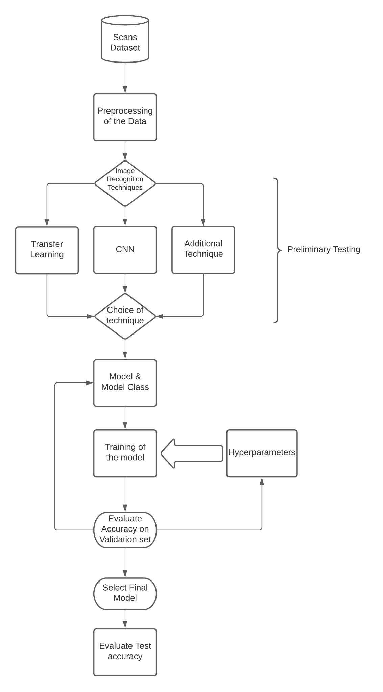
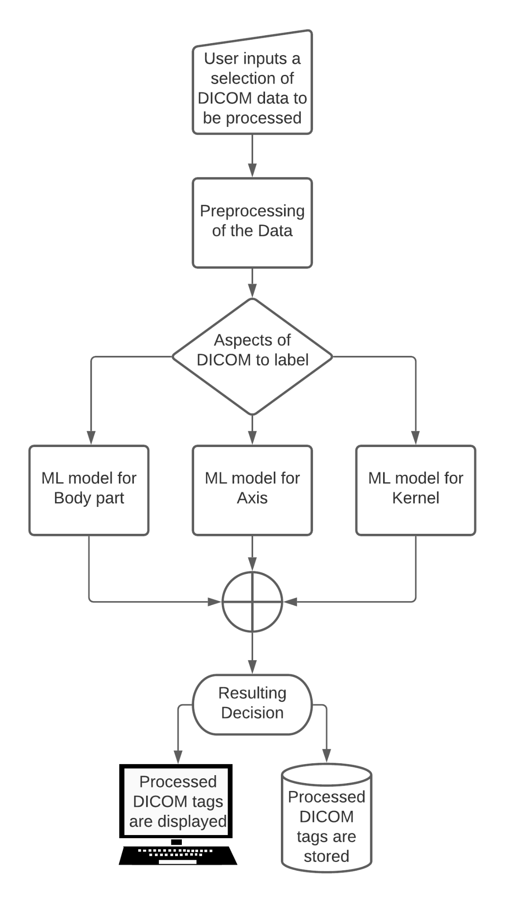
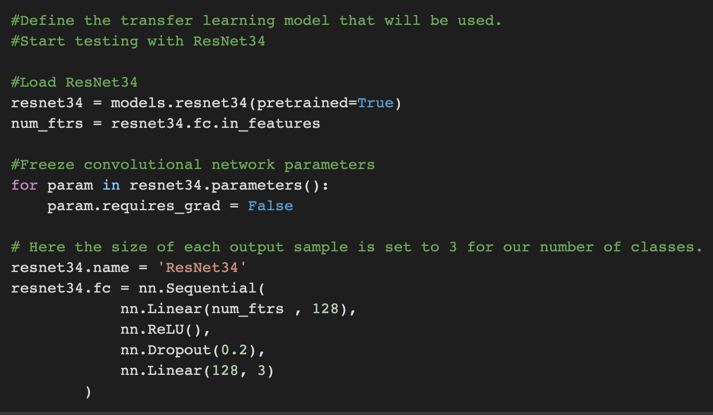
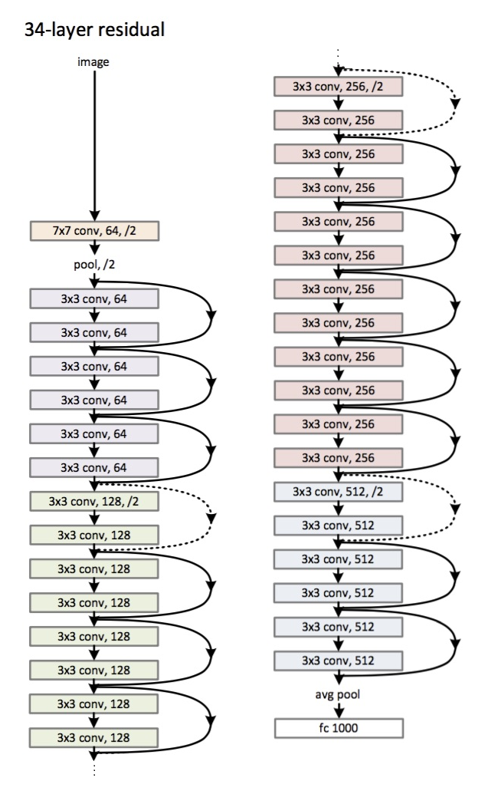
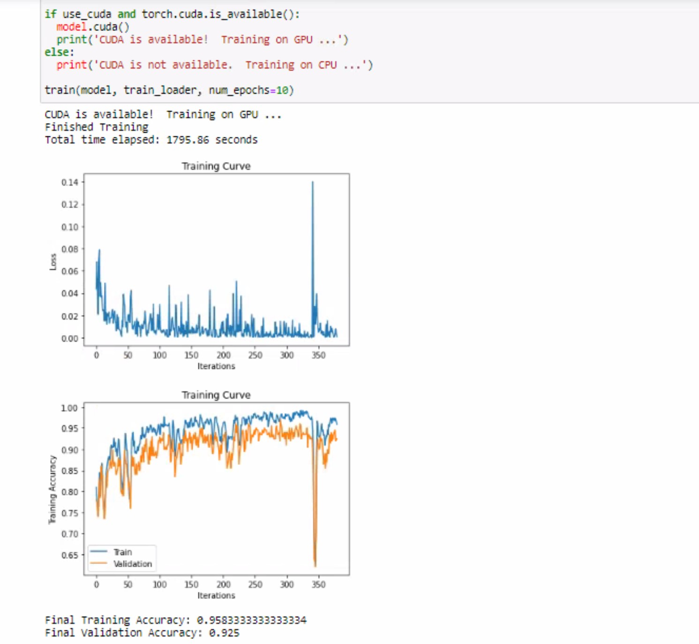
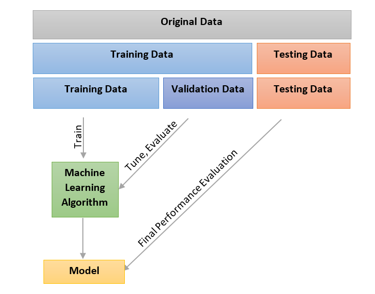
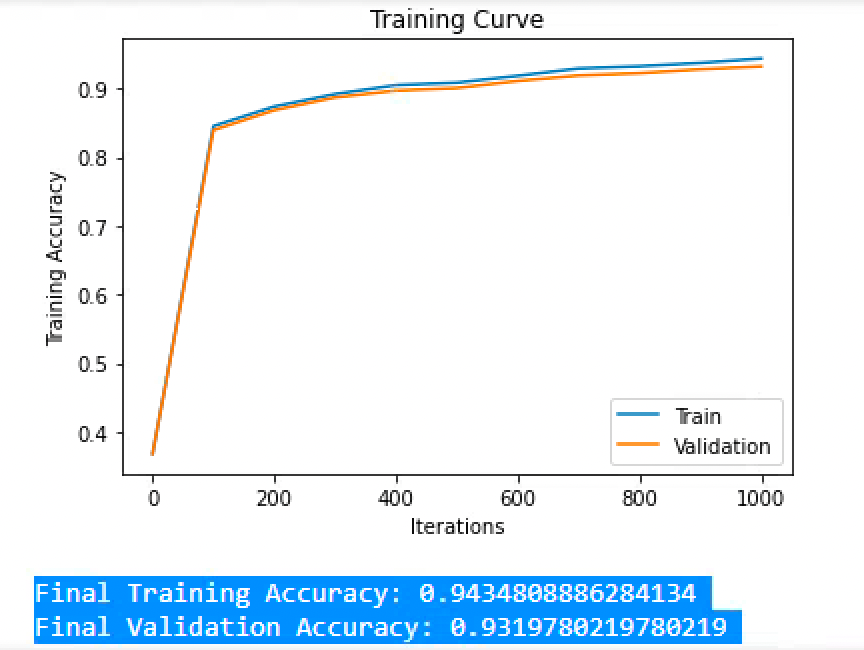

# Machine Learning Classification of Body Part, Imaging Axis, and Intravenous Contrast Enhancement on CT Imaging

### Overview of the abstract as it appears in the Canadian Association of Radiologists Journal

Developed and validated a suite of deep learning models using PyTorch for automated analysis of CT imaging data. This project, published in the Canadian Association of Radiologists Journal (CARJ) and the Radiological Society of North America (RSNA) Journal, focused on classifying three crucial aspects of CT series:

Body Part Identification: Accurately identified 16 different body parts with 96.0% accuracy (95% CI: 94.6%, 97.2%).

Imaging Axis Determination: Determined the axis of imaging with 99.2% accuracy (95% CI: 98.5%, 99.7%).

Intravenous Contrast Detection: Identified the presence of intravenous contrast with 97.5% accuracy (95% CI: 96.4%, 98.5%).

The models were trained on a dataset of 6955 CT series, rigorously validated internally, and further validated externally on a dataset of 35,272 series from 7 public datasets, demonstrating strong generalizability (accuracies ranging from 87.8% to 100%). This project showcases proficiency in applying advanced AI techniques to solve real-world challenges in medical image analysis.

### Repository contains

This repository contains early demo snippets of the TensorFlow-based code and information related to our research paper on using machine learning for automated classification of CT series. The code may be used for visualizing anonymized public health DICOM data and exploring the initial training viability of our CT classification methods using open public anonymized data. 

Due to potential legal and licensing complexities, the final ResNet PyTorch implementation is not included in this public release.

The published PDF of this paper, as it appears in the Canadian Association of Radiologists' Journal (CARJ), is included in this repository for reference purposes.

In addition, a selection of metrics from the original research is also presented in the readme.md.

## Overview

**Problem:** Manually classifying CT scans for body part, imaging axis, and contrast enhancement is time-consuming and prone to errors due to inconsistencies in DICOM metadata. This hinders dataset curation and can lead to issues in clinical deployment of AI models.

**Solution:** We developed and evaluated deep learning models to automatically classify CT series based on these three crucial parameters.

**Methods:**

*   We used a retrospective dataset of 6955 CT series from our institution, annotated by expert radiologists.
*   The dataset was split into training (70%), validation (20%), and testing (10%) sets.
*   We trained three separate 3D ResNet models for each classification task: body part (16 classes), imaging axis (3 classes), and intravenous contrast (2 classes).
*   External validation was performed using 35,272 series from 7 publicly available datasets.

**Results:**

*   Our models achieved high accuracy on the internal test set: 96.0% for body part, 99.2% for imaging axis, and 97.5% for contrast enhancement.
*   External validation demonstrated strong generalizability with accuracies ranging from 89.7% to 97.8% for body part, 98.6% to 100% for imaging axis, and 87.8% to 98.6% for contrast enhancement.
*   Overall, the models correctly classified all three parameters for 92.7% of series in the internal test set and showed comparable performance on the pooled external validation dataset.

**Conclusion:** Our developed models demonstrate robust performance in automatically identifying key aspects of CT series, which can significantly improve dataset curation workflows and potentially enhance clinical applications.

## Chosen Preliminary Research Excerpts Showcase (Produced on anonymized open public data)
Please note that the published manuscript uses proprietary closed patient data and as such the code is not pubilished - the effectiveness demonstrated is vastly superior to the demo project that uses anonymized public open health data. This is a repository for the initial stages of the research that demonstarate viability of the approach. Research itself is also available as a PDF as it appears in CAR-J.

This flowchart outlines the methodology employed in our machine learning pipeline for CT image analysis. The process begins with a curated dataset of medical imaging scans, followed by preprocessing to standardize data formats and dimensions. The selection of image recognition techniques includes approaches like transfer learning, convolutional neural networks (CNNs), and additional methods, evaluated through preliminary testing. The chosen model and class undergo iterative training, optimized by hyperparameter tuning, and validated on a separate dataset to ensure generalizability. Finally, the selected model is tested on a holdout set for performance evaluation, completing the pipeline for accurate classification of imaging features such as body parts, imaging axes, and intravenous contrast.

This diagram illustrates the core functionality of the final design modules for DICOM data processing and machine learning classification. Users begin by selecting DICOM datasets, which undergo preprocessing to ensure uniformity and compatibility. The system then labels specific aspects of the DICOM files, such as the imaged body part, imaging axis, and reconstruction kernel, using dedicated machine learning models for each classification task. These outputs are consolidated into a final decision, with the results displayed for review or stored for future use, enabling streamlined integration into clinical workflows and data curation pipelines.

Our approach uses the ResNet34 architecture, a 34-layer residual convolutional network that enhances image feature extraction by preserving gradients through shortcut connections. This configuration is well-suited for image classification tasks due to its ability to learn complex hierarchical representations without suffering from vanishing gradients.

In our implementation, we employ a pre-trained ResNet34 model to leverage transfer learning on medical imaging data. We freeze the convolutional layers to retain learned feature extraction while customizing the fully connected layers to output predictions for our specific tasks: identifying body part, imaging axis, and kernel type. The model's performance is optimized through the addition of ReLU activations and dropout regularization to mitigate overfitting. Preliminary results indicate high accuracy and generalizability when tested on anonymized public health datasets.

This figure showcases the training and validation performance of our ResNet34-based model. Leveraging GPU acceleration, the training process achieved convergence within 10 epochs, taking approximately 1800 seconds using a subset of an open publicly available dataset.

The top plot illustrates the loss curve over iterations, demonstrating consistent reduction and stability towards the end of training. The bottom plot depicts the training and validation accuracy curves, which steadily increase and approach convergence, achieving a final training accuracy of 95.83% and a validation accuracy of 92.5%. These results highlight the effectiveness and generalization capability of the model on the validation set.

This diagram emphasizes the importance of proper data splitting to prevent contamination and ensure robust model evaluation. The original dataset is divided into training, validation, and testing subsets.

The training set is used to fit the machine learning algorithm, while the validation set facilitates hyperparameter tuning and evaluation during development. The final model is assessed on the test set, ensuring unbiased performance evaluation. This systematic approach minimizes overfitting and allows the model to generalize effectively to unseen data.

This training curve confirms the consistency and reliability of our model's performance. The plot illustrates the progression of training and validation accuracy across 1000 iterations. Both curves steadily converge, demonstrating effective learning and minimal overfitting.

The final training accuracy of 94.35% and validation accuracy of 93.20% indicate the model's strong capability to generalize, validating its robustness for the classification tasks. This balance reflects the careful tuning and appropriate dataset partitioning used in the training process.

## Why We Switched from TensorFlow to PyTorch

We initially started our project using TensorFlow but transitioned to PyTorch for several key reasons:

*   **Increased Flexibility and Easier Debugging:** PyTorch's dynamic computational graph allowed for more intuitive debugging and greater flexibility in model development and experimentation. We found it easier to prototype and modify our network architectures with PyTorch.
*   **Strong Community and Active Development:** PyTorch's rapidly growing and active community provides extensive support, readily available tutorials, and a continuous stream of updates and new features. This facilitated faster development and problem-solving.
*   **Pythonic Nature:** PyTorch's more "Pythonic" design felt more natural and easier to work with for our team, leading to a more streamlined development experience.
*   **Research Focus:** PyTorch is often favored in the research community, providing access to cutting-edge models and techniques. This was beneficial for exploring different network architectures and optimization strategies.

While TensorFlow is a powerful framework, PyTorch's strengths in flexibility, debugging, and its strong research community made it a better fit for our project's goals and development style.

## Attribution Statement

This LaTeX document is a formal larger write-up of research originally undertaken by Max Stepanov and Alexis Murari while affiliated with Unity Health and the University of Toronto's Computer Engineering department.